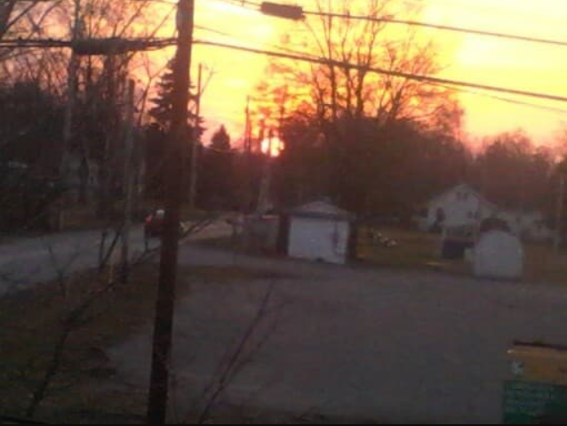

# Third unit

     </img>

<i> Had to stop the tour of d, because it got way too complicated for a beginner, instead i will be following some books and then revisit for frameworks maybe. Here we go with 0x3. </i>

---

## This weeks contents:

### `[1]` Blah blah ugh

